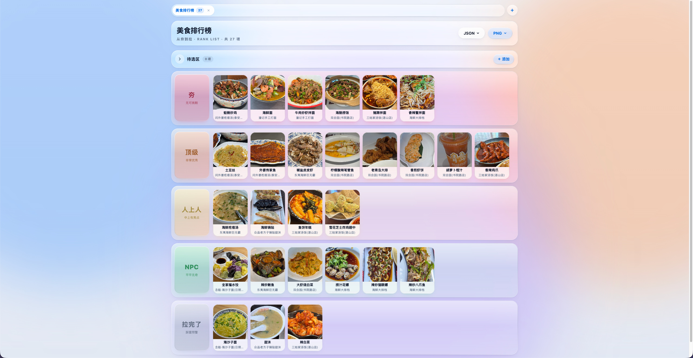

# 从夯到拉 · 排行榜

一个 Tier List 风格的等级排行榜单页应用：把条目分进 5 个等级（夯 / 顶级 / 人上人 / NPC / 拉完了），支持多分组管理多份榜单、图片待选区、拖拽换级排序、整榜导出图片与数据备份。

基于 React + Vite + Tailwind CSS 构建，液态玻璃拟态界面，数据保存在浏览器本地。



## 功能特性

- **多分组**：顶部标签页管理多份排行榜，支持新建 / 切换 / 删除分组（带条目数统计与删除确认），导入 JSON 也会生成新分组
- **待选区**：图片（点击 / 拖拽上传，自动压缩）与文字条目先进待选区暂存，可折叠收起
- **等级面板**：5 档等级行，卡片式条目展示（无图时以名称首字兜底）
- **拖拽**：待选区 / 等级行之间的卡片互相拖拽换级、行内排序（插入位置指示、拖到屏幕边缘自动滚动）；直接把图片文件拖到等级行或待选区可批量添加
- **批量操作**：待选区多选（支持全选）后批量加入某等级或批量删除
- **编辑**：双击卡片打开编辑弹窗（换图 / 改名 / 改备注 / 换级 / 删除），Esc 或点击遮罩关闭
- **图片预览**：点击卡片图片以 FLIP 动画放大预览，Esc 或点击关闭
- **导出**：Canvas 绘制整榜，支持复制到剪贴板（不可用时自动降级为下载）、下载 PNG；JSON 导出 / 导入（含格式校验，导入为新分组）
- **持久化**：IndexedDB 自动保存（250ms 防抖），本地存储写入异常时提示
- **视觉**：玻璃拟态多层渐变皮肤、背景色斑漂移 + 鼠标视差、`prefers-reduced-motion / transparency` 动效降级、640px 响应式断点

## 技术栈

| 依赖 | 说明 |
|---|---|
| React 19 | UI 框架 |
| Vite 8 | 构建工具（`base: './'` 相对路径） |
| Tailwind CSS 4 | 布局用原子类（`@tailwindcss/vite` 插件），皮肤样式保留在 `index.css` |
| oxlint | 代码检查 |

## 快速开始

```bash
npm install
npm run dev      # 启动开发服务器
npm run build    # 生产构建
npm run preview  # 预览构建产物
npm run lint     # 代码检查
```

## 项目结构

```
src/
├── main.jsx              # 入口，挂载 App + ToastProvider
├── App.jsx               # 分组状态管理、IndexedDB 持久化、导入导出
├── index.css             # Tailwind 入口 + 玻璃拟态皮肤样式
├── constants.js          # 等级配置 / 待选区标识 / 字体 / 存储键
├── storage.js            # IndexedDB 封装（分组记录 + 元信息）
├── utils.js              # 图片压缩、条目校验、Canvas 绘制辅助、FLIP 动画
├── hooks.js              # useHoverMenu 悬停菜单 hook
├── exportCanvas.js       # 整榜 Canvas 绘制、PNG / JSON 导出
└── components/
    ├── Blobs.jsx         # 背景色斑 + 鼠标视差
    ├── GroupTabs.jsx     # 分组标签页（新建 / 切换 / 删除）
    ├── TopBar.jsx        # 可编辑标题 + 操作按钮
    ├── ImagePool.jsx     # 待选区（上传 / 文字条目 / 多选批量操作）
    ├── PopMenu.jsx       # 悬停弹出菜单
    ├── Chevron.jsx       # 下拉箭头图标
    ├── PicDrop.jsx       # 图片上传区（弹窗复用）
    ├── TierPicker.jsx    # 等级选择器（弹窗复用）
    ├── Board.jsx         # 等级面板 + 待选区 / 等级行拖拽逻辑
    ├── EditModal.jsx     # 编辑弹窗
    ├── Lightbox.jsx      # 图片 FLIP 预览
    ├── Toast.jsx         # 全局提示
    └── ToastContext.jsx  # Toast 上下文
```

## 数据说明

- 数据保存在 IndexedDB（库名 `hang-rank`）：每个分组一条 `group:<id>` 记录，另有一条元信息记录保存当前分组与排序，异步写入不阻塞界面
- 图片上传自动压缩：最长边 900px，优先输出 WebP（质量 0.85），环境不支持时回退 JPEG
- 本地存储写入异常时会在界面给出提示

## GitHub Pages 部署

仓库内置 `.github/workflows/deploy.yml`：每次 push（`gh-pages` 分支除外）自动安装依赖、构建，并把 `dist` 推送到 `gh-pages` 分支。

首次使用需要：

1. 将项目推送到 GitHub
2. 仓库 **Settings → Pages → Build and deployment → Source** 选择 **Deploy from a branch**，分支选 **gh-pages** / **(root)**

配置完成后，每次 push 都会自动构建并发布到 GitHub Pages。
